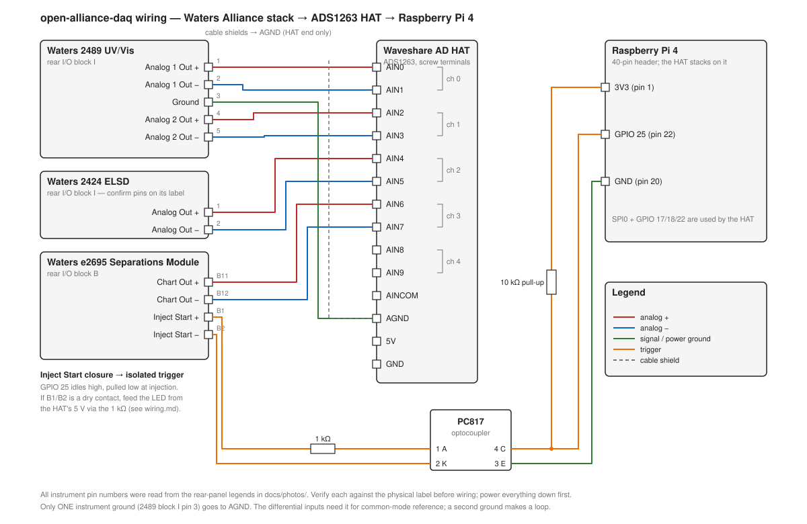

# open-alliance-daq

Open-source data acquisition for a Waters Alliance HPLC stack: **e2695 Separations Module,
2489 UV/Vis detector, 2424 Evaporative Light Scattering detector**, plus a second optical
detector. A Raspberry Pi 4 with a 32-bit ADC HAT records
the detectors' analog outputs, the e2695's Inject Start pulse provides hardware t0, and
Python integrates the peaks.



* [docs/plan.md](docs/plan.md) — why analog, what the closed ports are, the full design
* [docs/wiring.md](docs/wiring.md) — pin-by-pin wiring from the rear-panel photos
* [docs/instrument-identification.md](docs/instrument-identification.md) — what each module is, with evidence
* [docs/photos/](docs/photos/) — the rear-panel photos the plan is based on
* [docs/questions-for-previous-owner.md](docs/questions-for-previous-owner.md) — what only someone who ran this stack can answer

## Hardware

| Item | Notes |
|---|---|
| Raspberry Pi 4 (2 GB is plenty) | Pi OS Bookworm 64-bit, SPI enabled |
| Waveshare High-Precision AD HAT (ADS1263) | 5 differential channels, 32-bit, open schematic |
| PC817 optocoupler + 1 kΩ + 10 kΩ | isolates the e2695 Inject Start closure from the Pi GPIO |
| Shielded twisted pair, 22–24 AWG | one pair per analog channel |
| Isolated 5 V USB-C supply for the Pi | breaks the mains ground loop |

## Quick start (no hardware)

```bash
uv venv && uv pip install -e '.[dev]'
uv run alliance-daq record --simulate --trigger now --duration 200 --label demo
uv run alliance-daq peaks runs/*_demo.csv          # quick look, SciPy only
uv run alliance-daq quant runs/*_demo.csv --plot fit.png   # hplc-py skew-normal fit + peak table
uv run alliance-daq report runs/*_demo.csv --out demo.pdf   # LaTeX PDF: traces, fits, peak tables
uv run pytest
```

## On the Pi

```bash
sudo raspi-config nonint do_spi 0          # enable SPI
uv pip install -e '.[pi]'
alliance-daq live --rate 2                 # check every channel reads what the front panel shows
alliance-daq record --duration 900 --label std-mix --count 0   # arm; each Inject Start pulse starts a 15 min run
```

To run the logger as a service that re-arms after every injection, see `deploy/README.md`.

Edit `config/channels.example.toml` to match your detector output scaling and pass it
with `--channels`. Each run lands in `runs/` as a CSV with metadata comment lines;
`pandas.read_csv(path, comment="#")` reads it. `alliance-daq quant` fits and quantifies the peaks with
hplc-py, `alliance-daq report` turns one or more runs into a PDF, and `alliance-daq peaks` is
the dependency-free quick look. An R alternative using chromatographR and knitr is in
`r/report.Rnw` (tested locally with R 4.6.1; chromatographR comes from the author's r-universe since CRAN archived it).

## Layout

```
alliance_daq/
  adc.py         ADS1263 back-end and a synthetic-chromatogram simulator
  trigger.py     Inject Start GPIO trigger (gpiozero), keyboard, timed, immediate
  channels.py    TOML channel map and unit scaling
  logger.py      fixed-rate acquisition loop -> CSV with metadata header
  analysis.py    quick-look: ALS baseline, peak finding, trapezoid integration
  quant.py       method-grade: hplc-py skew-normal peak fitting and quantification
  report.py      PDF report: matplotlib figures + Jinja2 LaTeX template, compiled with tectonic
  cli.py         alliance-daq record | live | peaks | quant | report
  templates/     report.tex.j2
  vendor/waveshare/   Waveshare's MIT ADS1263 driver, one import line patched
```

## License

MIT. The vendored Waveshare driver is also MIT; see `alliance_daq/vendor/waveshare/LICENSE`.
